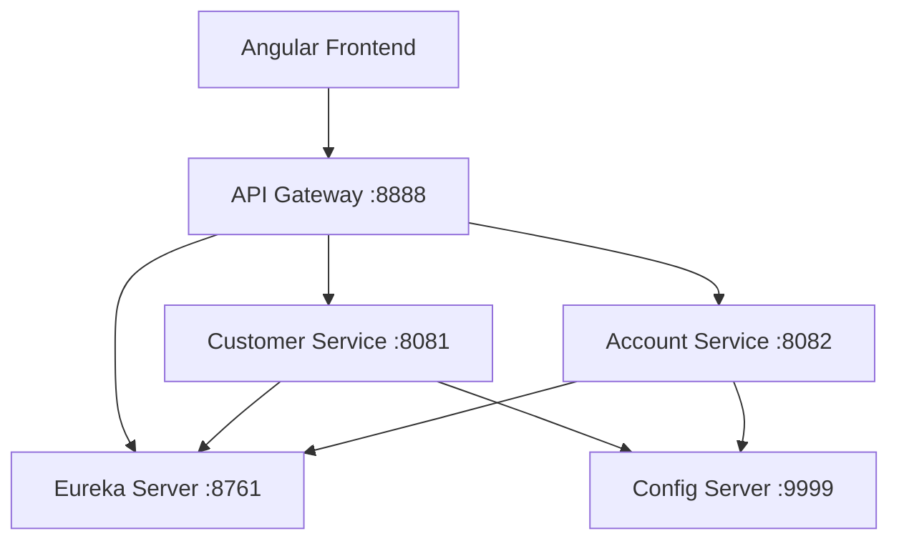
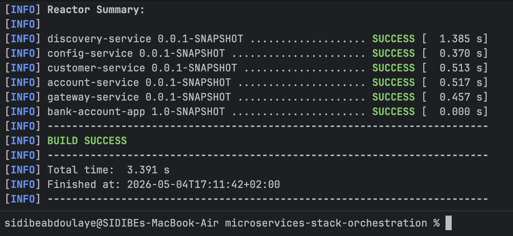
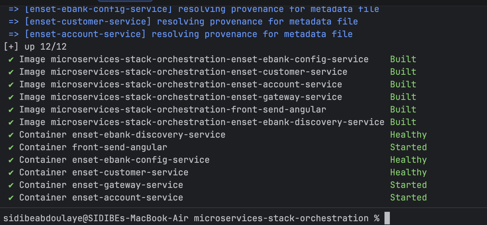
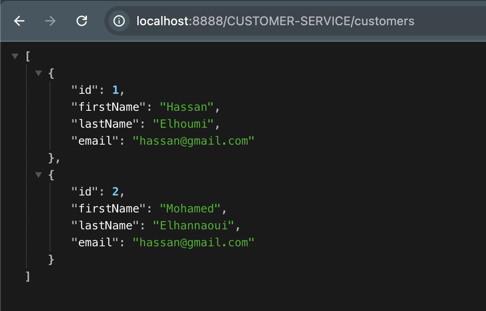
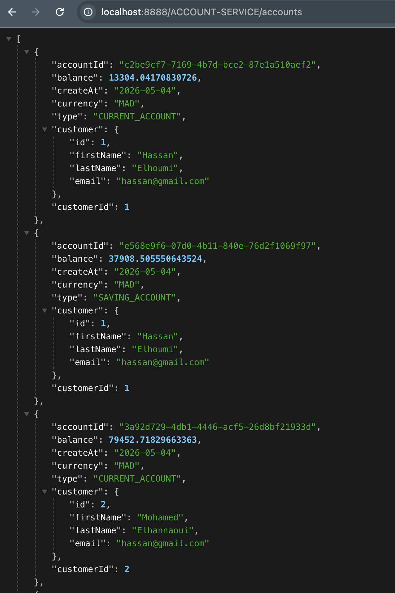
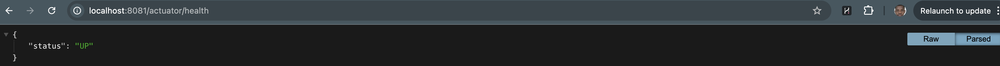

# Microservices Stack Orchestration - E-Banking System

Ce projet est une application de gestion bancaire basée sur une architecture microservices robuste utilisant **Spring Boot**, **Spring Cloud** et **Angular**.

---

## 🚀 Architecture du Système

L'écosystème est composé des modules suivants :

*   **Discovery Service (Eureka)** : Service de découverte permettant l'enregistrement et la localisation des microservices.
*   **Config Server** : Gestion centralisée de la configuration via un dépôt Git.
*   **Gateway Service** : Point d'entrée unique de l'application (Routing dynamique).
*   **Customer Service** : Gestion des clients (Données métier).
*   **Account Service** : Gestion des comptes bancaires et transactions.
*   **Angular Front-End** : Interface utilisateur moderne pour interagir avec le système.

### Patterns Microservices Utilisés

#### Service Discovery (Netflix Eureka)
Chaque instance de microservice s'enregistre auprès du serveur Eureka au démarrage. Cela permet :
*   Le **Load Balancing** côté client.
*   L'abstraction des adresses IP et des ports.
*   La haute disponibilité.


#### Configuration Centralisée (Spring Cloud Config)
Toutes les configurations (fichiers `.properties` ou `.yml`) sont stockées dans un dépôt Git externe ou local.
*   **Avantage** : Modification des paramètres sans recompiler ou redémarrer les services (via `/actuator/refresh`).
*   **Sécurité** : Séparation stricte entre le code et la configuration.

#### API Gateway (Spring Cloud Gateway)
Toutes les requêtes externes passent par ce composant.
*   **Routage Dynamique** : Utilise le Discovery Client pour router les requêtes vers les services disponibles (ex: `/CUSTOMER-SERVICE/**`).
*   **Sécurité Centralisée** : Point idéal pour implémenter l'authentification (JWT) et le Rate Limiting.

### Diagramme de Flux (Conceptuel)



---

## 🛠 Tech Stack

*   **Backend** : Java 17, Spring Boot 3, Spring Cloud (Gateway, Config, Eureka).
*   **Frontend** : Angular, Bootstrap.
*   **DevOps** : Docker, Docker Compose.
*   **Database** : H2 (In-Memory) pour le développement.

---

## 🏁 Démarrage Rapide

### Prérequis
*   Docker & Docker Compose
*   JDK 17+
*   Maven

### Lancement avec Docker (Recommandé)

```bash
# Compiler les JARs
mvn clean package -DskipTests
```


```bash
# Lancer la stack
docker-compose up -d --build
```


### Accès aux Services
*   **Eureka Dashboard** : [http://localhost:8761](http://localhost:8761)
*   **Config Server** : [http://localhost:9999](http://localhost:9999)
*   **Gateway Service** : [http://localhost:8888](http://localhost:8888)
*   **Angular Frontend** : [http://localhost:82](http://localhost:82)

---

## 📖 Guide des APIs

Toutes les APIs sont accessibles via la **Gateway (port 8888)**.

### 1. Customer Service
| Action | Méthode | Endpoint Gateway | Description |
| :--- | :--- | :--- | :--- |
| Lister les clients | `GET` | `/CUSTOMER-SERVICE/customers` | Récupère tous les clients. |
| Détails client | `GET` | `/CUSTOMER-SERVICE/customers/{id}` | Récupère un client par son ID. |



### 2. Account Service
| Action | Méthode | Endpoint Gateway | Description |
| :--- | :--- | :--- | :--- |
| Lister les comptes | `GET` | `/ACCOUNT-SERVICE/accounts` | Récupère tous les comptes. |
| Détails compte | `GET` | `/ACCOUNT-SERVICE/accounts/{id}` | Récupère un compte avec les infos client. |



---

## 🧪 Guide de Test & Validation

### Vérification de l'Infrastructure
Ouvrez [http://localhost:8761](http://localhost:8761) : Vous devez voir tous les services enregistrés.


### Health Checks
Vérifiez l'état de santé : `curl http://localhost:8081/actuator/health`


### Interface UI
Ouvrez [http://localhost:82](http://localhost:82) pour tester l'interface Angular.


---

## 📦 Déploiement & DevOps

### Ordre de Démarrage
1. Eureka -> 2. Config -> 3. Microservices -> 4. Gateway -> 5. Angular

### Troubleshooting
*   **Eureka** : Vérifiez la connectivité réseau interne Docker.
*   **Config** : Vérifiez le chemin du dépôt Git dans `config-repo`.
*   **CORS** : Configuration gérée au niveau de la Gateway.

---

## 🔗 Liens vers les Documents Complets
*   [Architecture Détaillée](./docs/ARCHITECTURE.md)
*   [Guide de Déploiement](./docs/DEPLOYMENT_GUIDE.md)
*   [Guide API](./docs/API_GUIDE.md)
*   [Guide de Test Docker](./docs/DOCKER_TESTING_GUIDE.md)
*   [Guide Technique](./docs/guide.md)
