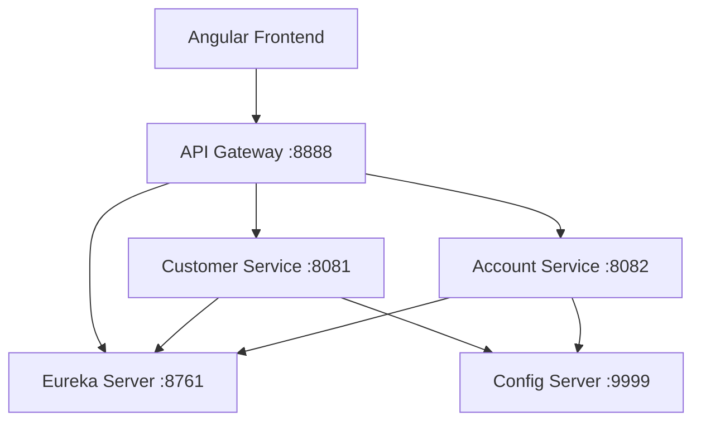
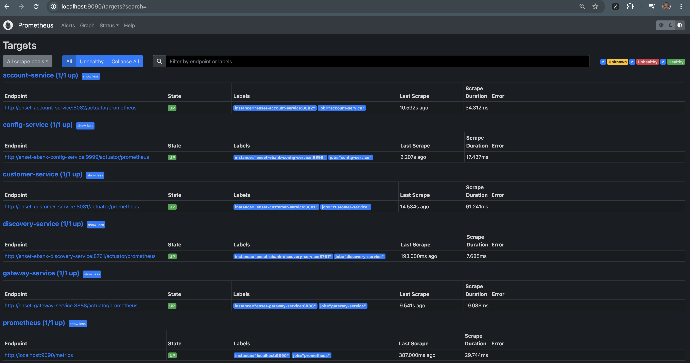

# Architecture & Design

Ce document détaille les choix architecturaux et les patterns mis en œuvre dans le projet.

## 1. Patterns Microservices Utilisés

### Service Discovery (Netflix Eureka)
Chaque instance de microservice s'enregistre auprès du serveur Eureka au démarrage. Cela permet :
*   Le **Load Balancing** côté client.
*   L'abstraction des adresses IP et des ports.
*   La haute disponibilité.

### Configuration Centralisée (Spring Cloud Config)
Toutes les configurations (fichiers `.properties` ou `.yml`) sont stockées dans un dépôt Git externe ou local.
*   **Avantage** : Modification des paramètres sans recompiler ou redémarrer les services (via `/actuator/refresh`).
*   **Sécurité** : Séparation stricte entre le code et la configuration.

### API Gateway (Spring Cloud Gateway)
Toutes les requêtes externes passent par ce composant.
*   **Routage Dynamique** : Utilise le Discovery Client pour router les requêtes vers les services disponibles (ex: `/CUSTOMER-SERVICE/**`).
*   **Sécurité Centralisée** : Point idéal pour implémenter l'authentification (JWT) et le Rate Limiting.

## 2. Diagramme de Flux (Conceptuel)

## 3. Communication Inter-Service
Le système utilise principalement des communications synchrones via **REST** (RestTemplate ou OpenFeign).
*   `Account Service` communique avec `Customer Service` pour valider l'existence d'un client lors de la création d'un compte.

## 5. Observabilité & Monitoring
Le projet intègre une stack de monitoring complète basée sur **Prometheus** et **Grafana**.

- **Collecte des métriques** : Chaque microservice expose ses métriques métier et système (JVM, HTTP) via l'endpoint `/actuator/prometheus`.
- **Scraping** : Prometheus est configuré pour collecter périodiquement ces données.
- **Visualisation** : Grafana permet de créer des dashboards pour monitorer le taux de requêtes (Rate), les erreurs (Errors) et la latence (Duration) - méthode RED.
- **Alerting** : Alertmanager gère les notifications en cas de dépassement de seuils critiques.

