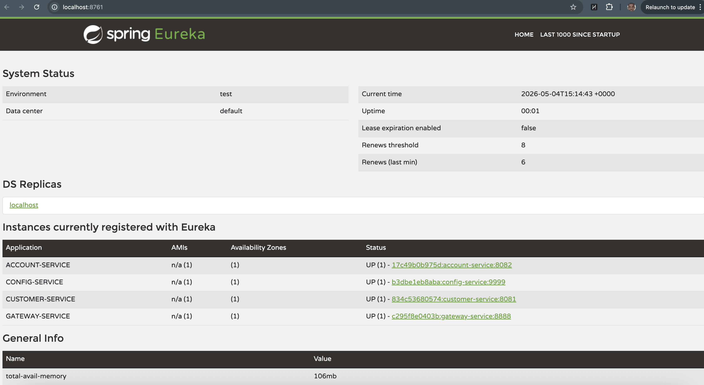
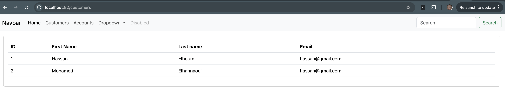

# Guide Technique Détaillé - Microservices Stack Orchestration

Ce guide apporte des détails techniques approfondis sur les choix d'architecture, la configuration et le fonctionnement interne des composants de l'application bancaire.

## 1. Spring Cloud Config (Service de Configuration)
Le `config-service` externalise la configuration pour faciliter la gestion multi-environnements.
- **Source** : Point vers un dépôt Git via `spring.cloud.config.server.git.uri`.
- **Rafraîchissement** : Utilisation de `@RefreshScope` sur les beans pour mettre à jour les propriétés à chaud via `/actuator/refresh`.

## 2. Service Discovery (Netflix Eureka)
Le `discovery-service` agit comme un annuaire dynamique.
- **Enregistrement** : `@EnableDiscoveryClient` permet aux services de s'auto-déclarer.
- **Résilience** : Eureka gère les battements de cœur (heartbeats) pour détecter les instances défaillantes.

## 3. Spring Cloud Gateway (Point d'Entrée)
Le `gateway-service` est un routeur réactif (basé sur Project Reactor).
- **Routage Dynamique** : Les routes sont résolues via Eureka (`/SERVICE-NAME/**`).
- **Sécurité** : Point central pour la gestion des CORS et du filtrage des requêtes.

## 4. Communication Inter-Services (OpenFeign)
L'interaction entre `account-service` et `customer-service` est gérée par **OpenFeign**.
- **Déclaratif** : Interface `@FeignClient(name = "CUSTOMER-SERVICE")`.
- **Load Balancing** : Intégré nativement avec Eureka pour répartir la charge sur les instances disponibles.

## 5. Modèle de Données & Persistance
- **Database per Service** : Utilisation de bases H2 distinctes en mode in-memory pour le développement.
- **Spring Data JPA** : Abstraction de la couche de données avec des repositories clean.
- **DTO Pattern** : Séparation des entités de persistance et des objets d'échange (API) pour plus de flexibilité.

## 6. Monitoring & Actuator
Chaque service expose des métriques via `/actuator`.
- **Health** : État de santé du service et de ses dépendances (DB, Config, Discovery).
- **Beans** : Liste des beans chargés dans le contexte Spring.
- **Env** : Visualisation des propriétés de configuration chargées.

---
*Voir aussi :*
- [Architecture Générale](./ARCHITECTURE.md)
- [Guide des APIs](./API_GUIDE.md)
- [Déploiement & DevOps](./DEPLOYMENT_GUIDE.md)
