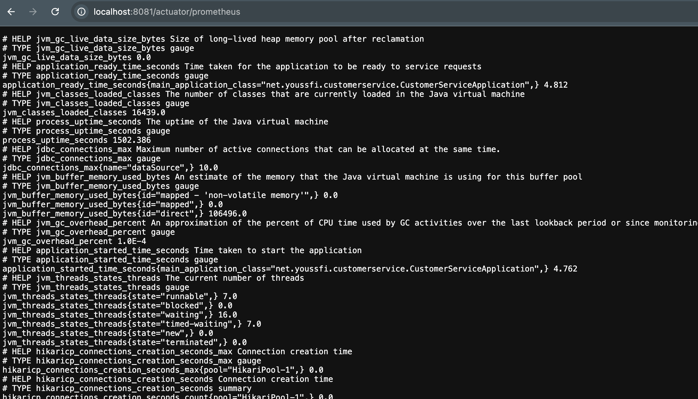
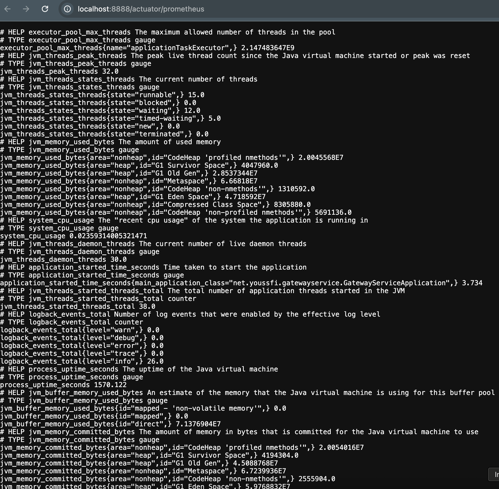
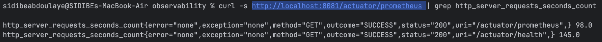
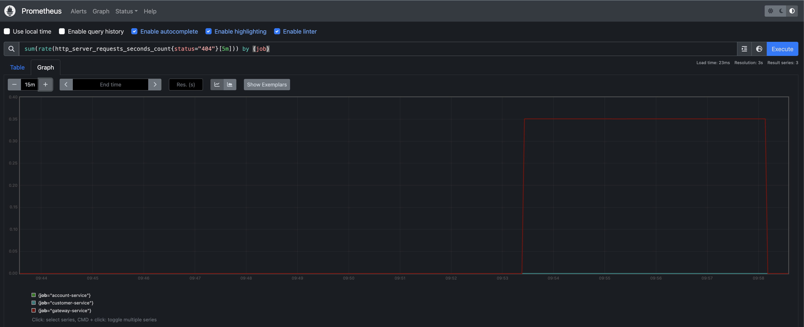
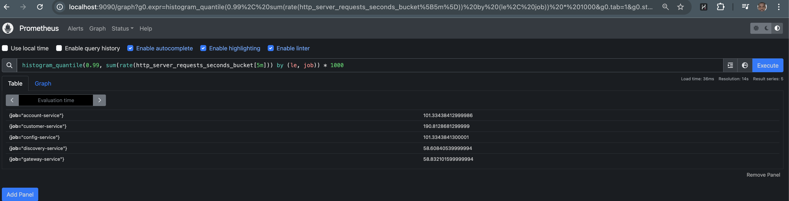
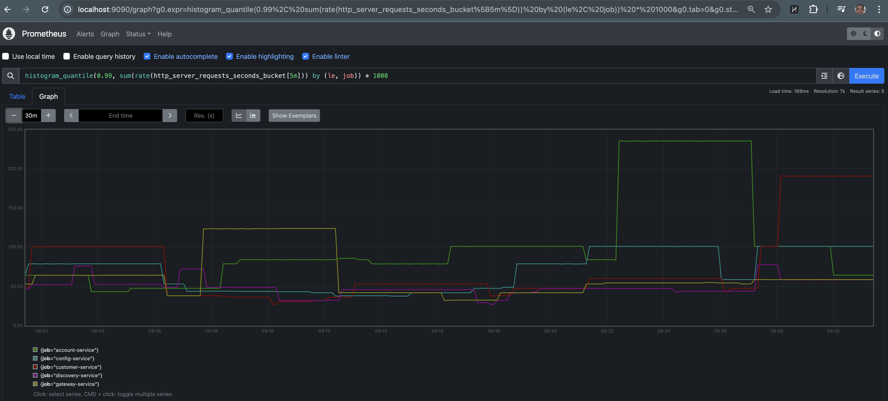
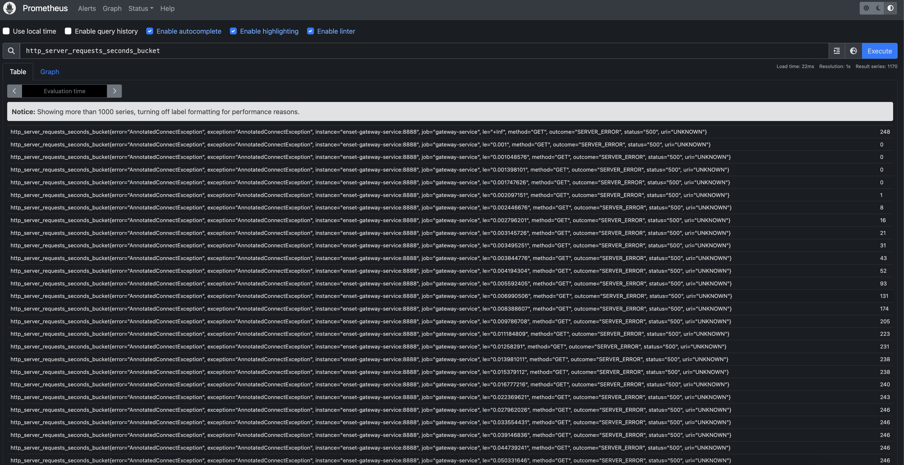
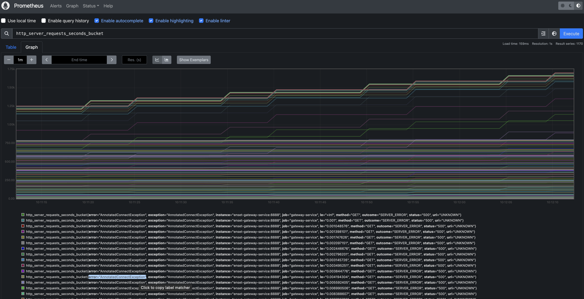
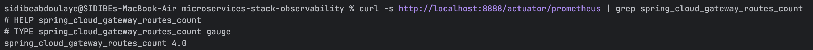
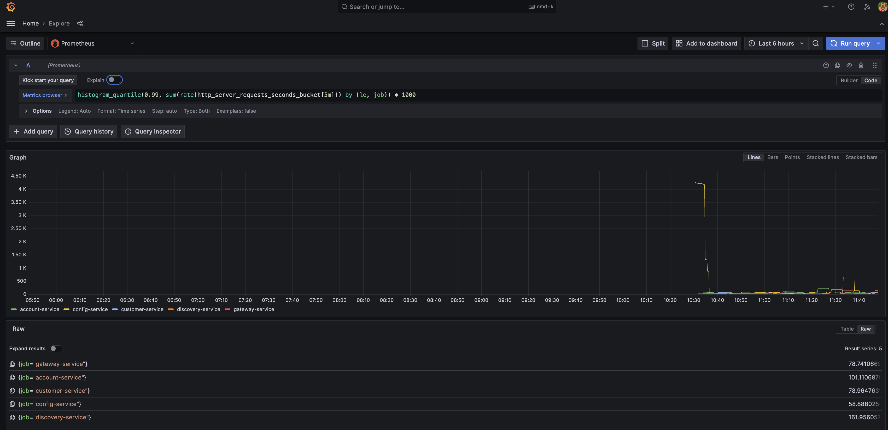

# TP Jour 3 — Prometheus, Grafana & Alerting

## 🎯 Objectifs

- Instrumenter chaque service avec **prom-client** (Node.js) ou **prometheus_client** (Python)
- Brancher **Prometheus** pour collecter les métriques automatiquement
- Créer un **dashboard Grafana** avec la méthode RED (Rate, Errors, Duration)
- Configurer **2 alertes** dans Alertmanager
- Rédiger un **SLO** avec calcul de l'error budget

---

## 📁 Fichiers fournis

```
TP-Jour3/
├── instrumentation.js          ← Middleware Prometheus pour Express (Node.js)
├── prometheus.yml              ← Config Prometheus (à adapter à vos services)
├── alert_rules.yml             ← 4 règles d'alerte préconfigurées
├── alertmanager.yml            ← Config Alertmanager avec inhibition rules
├── docker-compose.monitoring.yml ← Stack Prometheus + Grafana + Alertmanager
└── slo.md                      ← Template SLO à compléter avec vos mesures
```

---

## 🚀 Étape 1 — Instrumenter vos services

### Node.js — Ajoutez prom-client

```bash
# Dans chaque dossier de service
npm install prom-client
```

Copiez `instrumentation.js` dans chaque service, puis modifiez `index.js` :

```javascript
// Au début de index.js (après les requires existants)
const { register, trackRequest } = require('./instrumentation');

// Après app = express()
app.use(trackRequest);

// Remplacez votre ancien endpoint /metrics par celui-ci :
app.get('/metrics', async (req, res) => {
  res.set('Content-Type', register.contentType);
  res.end(await register.metrics());
});
```

### Python — Ajoutez prometheus_client

```bash
pip install prometheus_client
```

```python
from prometheus_client import Counter, Histogram, generate_latest, CONTENT_TYPE_LATEST
import time

requests_total = Counter(
    'http_requests_total', 'Total requests',
    ['method', 'path', 'status']
)
request_duration = Histogram(
    'http_duration_seconds', 'Request duration in seconds',
    ['method', 'path'],
    buckets=[.005, .01, .025, .05, .1, .25, .5, 1, 2.5, 5]
)

@app.middleware("http")
async def track_metrics(request, call_next):
    start = time.time()
    response = await call_next(request)
    duration = time.time() - start
    requests_total.labels(request.method, request.url.path, response.status_code).inc()
    request_duration.labels(request.method, request.url.path).observe(duration)
    return response

@app.get("/metrics")
def metrics():
    from fastapi.responses import Response
    return Response(generate_latest(), media_type=CONTENT_TYPE_LATEST)
```

### Actuator Metrics (Spring Boot)

Chaque service Spring Boot expose ses métriques sur `/actuator/prometheus`.





---

## 🚀 Étape 2 — Lancer la stack de monitoring

```bash
# Option A : Fusionnez docker-compose.monitoring.yml dans votre docker-compose.yml
# Option B : Utilisez l'override (recommandé)
docker-compose -f docker-compose.yml -f docker-compose.monitoring.yml up --build
```

Vérifiez que Prometheus scrape bien vos services :
- Ouvrez http://localhost:9090/targets
- Tous vos services doivent être en **State: UP**


---

## 🚀 Étape 3 — Créer le dashboard Grafana

1. Ouvrez Grafana : http://localhost:3100 (admin / devops2024)
2. **Configuration → Data Sources → Add data source → Prometheus**
   - URL : `http://prometheus:9090`
   - Cliquez "Save & Test"
3. **Dashboards → New dashboard → Add visualization**

### Panel 1 — Rate (requêtes/seconde)
```promql
sum(rate(http_server_requests_seconds_count[5m])) by (job)
```
Type : **Time series** | Titre : "Requests per second by service"



### Panel 2 — Errors (% d'erreur)
```promql
sum(rate(http_server_requests_seconds_count{status=~"5.."}[5m])) by (job)
/
sum(rate(http_server_requests_seconds_count[5m])) by (job)
* 100
```
Type : **Stat** | Titre : "Error rate %" | Seuils : vert 0, orange 1, rouge 5



### Panel 3 — Duration (latence p99)
```promql
histogram_quantile(
  0.99,
  sum(rate(http_server_requests_seconds_bucket[5m])) by (le, job)
) * 1000
```
Type : **Time series** | Titre : "p99 Latency (ms)" | Unité : milliseconds




#### Détails des Buckets HTTP
Visualisation des seaux de latence :



### Panel 4 — Mémoire JVM (bonus)
```promql
sum(jvm_memory_used_bytes) by (job)
```
Type : **Gauge** | Titre : "JVM Memory Usage"


### Panel 5 — Gateway Routes (bonus)
```promql
spring_cloud_gateway_routes_count
```


---

## 🚀 Étape 4 — Tester les alertes

### Générer des erreurs pour déclencher HighErrorRate

```bash
# Script pour générer des erreurs via la Gateway
for i in $(seq 1 50); do
  curl -s http://localhost:8888/endpoint-qui-nexiste-pas > /dev/null
  sleep 0.1
done
```

Puis vérifiez dans Prometheus → Alerts que `HighErrorRate` passe en **FIRING**.



---

## 📋 Critères de notation

| Critère | Points |
|---------|--------|
| Services instrumentés (Counter + Histogram via prom-client) | 4 pts |
| Prometheus scrape tous les services (State: UP dans /targets) | 2 pts |
| Dashboard Grafana avec 3 panels RED | 4 pts |
| Alertes HighErrorRate + HighLatencyP99 configurées | 4 pts |
| Fichier `slo.md` complété avec mesures réelles PromQL | 3 pts |
| **Bonus** : alerte envoyée via Slack/webhook réel | +2 pts |
| **Bonus** : 4ème panel (gauge en cours, mémoire…) | +1 pt |

---

## 📦 Livrable à 17h

1. Code Git avec instrumentation dans tous les services
2. Capture d'écran du dashboard Grafana (collez dans README)
3. Fichier `alert_rules.yml` avec vos alertes
4. Fichier `slo.md` complété avec vos valeurs PromQL réelles
